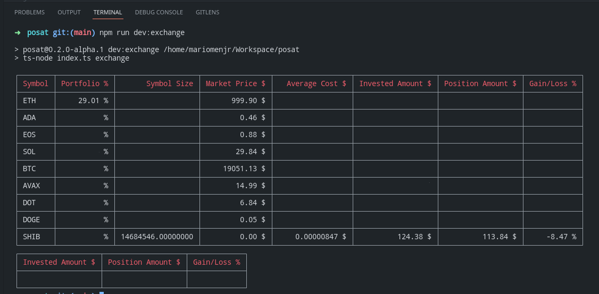

# mariomenjr/posat

Build a positions report from Fills in Coinbase.


<sub>Symbol Size, Average Cost, Invested Amount, Position Amount, and Gain/Loss fields were hidden due to privacy concerns.</sub>

## Usage

Currently, you can produce a meaningful positions reports either by using the `exchange` or `csv` flags.

### Exchange

#### API Credentials

In order to connect to Coinbase, you'll need to setup an API key. From coinbase's [website](https://help.coinbase.com/en/pro/other-topics/api/how-do-i-create-an-api-key-for-coinbase-pro), follow the following steps:

> To create an API key unique to your trading account:
>
> 1. Select the Menu in the top-right corner of the Coinbase Pro dashboard on the website. Managing API keys is not currently supported on the Coinbase Pro mobile app
> 2. Select the API link from the menu
> 3. Under Profile Information, select the API Settings tab, then select + New API Key
> 4. Select your profile and appropriate permissions, create a passphrase, and then enter in your 2-Factor Authentication code 
> 5. Finally, select Create API Key at the bottom to make a unique key. The new API key and secret will be displayed on the API Settings page.

Once you have it, please create an `.env` file with the following values:

```.env
CB_API_KEY=
CB_API_SECRET=
CB_PASSPHRASE=
```

#### Command

```bash
npm run dev:exchange
```

#### Features

There are two features that can be helpful to consolidate external transactions or achieve a better cost analysis. For instance, they become handy when you've received coins as payment or purchased them from a different exchange; or when you need to remove or consolidate transactions.

##### Fill To Push

Under the `custom` folder, you'll find the `fills.push.json` file which allow you to list under an array a series of transactions to be included in the cost basis analysis. The format for this transactions is as follows:

```json
{
  "portfolio": "default",
  "tradeId": 109698543,
  "product": "ETH-USD",
  "side": "SELL",
  "createdAt": "2021-05-10T04:41:38.708Z",
  "fiatUnit": "USD",
  "size": 0.073549,
  "sizeUnit": "ETH",
  "price": 3946.42,
  "fee": 14.09,
  "total": -276.25
},
```

##### Fills To Ignore

Similarly, you'll find the `fills.ignore.json` file where you'll be able to list the `tradeId`s of those transactions retrieved from the Exchange that you want to exclude from the analysis.

### CSV

Place the `.csv` file reports from Coinbase Pro inside the `fills` folder.

```bash
npm run dev:csv
```

## Notes

The app only supports Coinbase Pro, but it is perfectly expandable to work with another exchange. Feel free to fork or contribute changes to the repository.

## License

The source code of this project is under [MIT License](https://opensource.org/licenses/MIT).